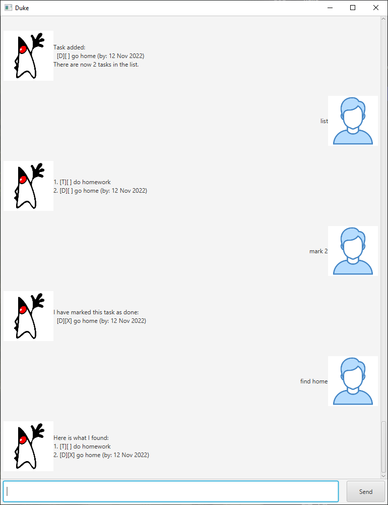

# User Guide

Duke is a desktop application for **tracking tasks** in the style of a chatbot. Developed with _love_ using JavaFX.



## Features

---

### GUI

You can interact with Duke in a beautiful GUI developed with JavaFX.

### Persistent storage

You can tell Duke to add tasks and store them in a list. Your tasks will be stored in a text file and will still be available for you the next time you open Duke.

### Marking tasks

Once you have completed a task, you can mark the status of it in Duke.

### Filtering tasks

You can filter for specific tasks by searching for keywords in the task's description.

## Usage

---

### `list` - List all tasks you have added

This command will list all the tasks in the task list.

**Usage:** `list`

**Expected outcome**

```
> list

1. [T][x] read book
2. [D][ ] sweep the floor (by: 10 Oct 2022)
```

---

<br>

### `todo` - Add a Todo task to the task list

**Usage:** `todo <task description>`

A todo task with the task description specified will be added to the task list.

**Expected outcome**

```
> todo do homework

Task added:
  [T][] do homework
There are not 3 tasks in the list.
```

---

<br>

### `deadline` - Add a Deadline task to the task list

**Usage:** `deadline <task description> /by <date>`

A deadline task with the specified description and date will be added to the task list.

> Note: the format of `date` should be `YYYY-MM-DD`. <br>
> eg. `2022-10-01` for 1st October 2022

**Expected outcome**

```
> deadline go home /by 2022-11-12

Task added:
  [D][ ] go home (by: 12 Nov 2022)
There are not 4 tasks in the list.
```

---

<br>

### `event` - Add an Event task to the task list

**Usage:** `event <task description> /at <date>`

An event task with the specified description and date will be added to the task list.

> Note: the format of `date` should be `YYYY-MM-DD`. <br>
> eg. `2022-10-01` for 1st October 2022

**Expected outcome**

```
> event sale /at 2022-12-12

Task added:
  [E][ ] sale (at: 12 Dec 2022)
There are not 5 tasks in the list.
```

---

<br>

### `delete` - Delete a task from the task list

**Usage:** `delete <index>`

Remove the task specified by the index from the task list and the storage file.

**Expected outcome**

```
> delete 5

Task deleted:
  [E][ ] sale (at: 12 Dec 2022)
There are not 4 tasks in the list.
```

---

<br>

### `mark` - Mark a task

**Usage:** `mark <index>`

Mark the task specified by the index as complete.

**Expected outcome\*\***

```
> mark 4

I have marked this task as done:
  [D][X] go home (by: 12 Nov 2022)
```

---

<br>

### `unmark` - Unmark a task

**Usage:** `unmark <index>`

Mark the task specified by the index as incomplete.

**Expected outcome**

```
> unmark 4

I have unmarked the completion of this task:
  [D][ ] go home (by: 12 Nov 2022)
```

---

<br>

### `update` - Update the description of a task

**Usage:** `update <index> <new description>`

Update the task specified by the index with a new description.

**Expected outcome**

```
> update 4 go back home

I have updated the description of this task:
  [D][ ] go back home (by: 12 Nov 2022)
```

---

<br>

### `find` - Look for tasks in the task list

**Usage:** `find <search query>`

Search the task list for a task with a description containing the query specified.

**Expected outcome**

```
> find home

This is what I found:
  1. [T][] do homework
  2. [D][] go back home (by: 12 Nov 2022)
```

---

<br>

### `bye` - Exit the application

**Usage:** `bye`

**Expected outcome**

```
> bye

Bye bye!
```

The window will then be closed.

---

<br>

# References

JavaFX GUI: https://se-education.org/guides/tutorials/javaFxPart1.html
